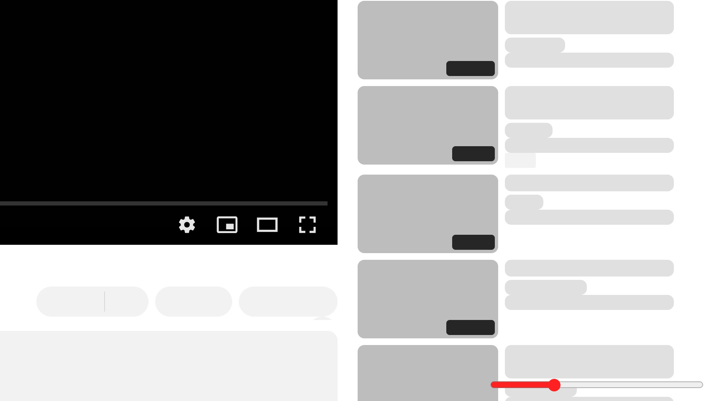

  

<h1 align="center">PlaybackRange</h1>

    Floating range input that sets your audio/video playback speed.

  

    <a href="#"><strong>Download</strong></a>

## How to use

1. [Download PlaybackRange](#);
2. Import it as bookmarks to your web browser:
    - [See how on Chrome](https://support.google.com/chrome/answer/96816?hl=en);
    - [See how on Firefox](https://support.mozilla.org/en-US/kb/import-bookmarks-html-file);
3. Go to any website with an HTML5 video or audio player and open `PlaybackRange` at favorites bar;
4. Slide the range at the right bottom corner of the screen;
7. Right click to reset;
7. Press `esc` to delete.

## License
This project is [MIT licensed](LICENSE).
